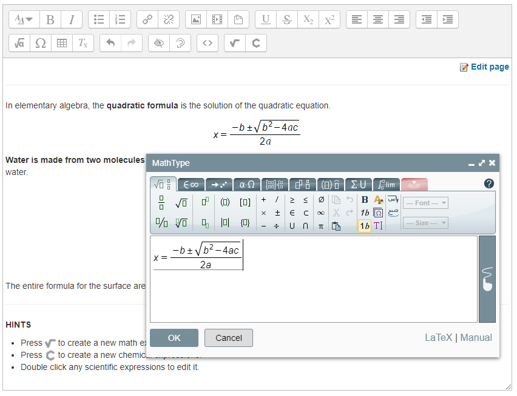

#  MathType Moodle plugin for TinyMCE

[](https://github.com/wiris/moodle-tinymce_tiny_mce_wiris/actions/workflows/moodle-ci.yml)

Type and handwrite mathematical notation in Moodle with [MathType](https://www.wiris.com/en/mathtype/) for TinyMCE editor.



## Introduction

[MathType](https://www.wiris.com/en/mathtype/) is a mathematical **visual (WYSIWYG) editor** containing a large collection of icons nicely organized in thematic tabs in order to create formulas or equations for any web content. **Maths and chemistry** toolbars are available from different icons in TinyMCE toolbar.

**Note**: MathType can be used for free up to a certain level of uses per natural year. Read [license conditions and prices](https://www.wiris.com/en/pricing/) on our website.

## Requirements

The [MathType filter plugin](https://github.com/wiris/moodle-filter_wiris) is required in order to use this plugin.

## Installation

Install the plugin like any other plugin to folder `lib/editor/tinymce/plugins/tiny_mce_wiris`.

You can use git:

```sh
$ cd <your-moodle-root-path>
$ git clone https://github.com/wiris/moodle-tinymce_tiny_mce_wiris.git lib/editor/tinymce/plugins/tiny_mce_wiris
```

Alternatively, you can [download the plugin](https://github.com/wiris/moodle-tinymce_tiny_mce_wiris/archive/stable.zip) and unzip the file into the TinyMCE plugins folder, and then rename the new folder to `tiny_mce_wiris`.

## Releases

Since version 7.24.0, all notable changes to this project are documented in the [CHANGES.md](CHANGES.md) file. You can download any release of this plugin from the [Official Moodle's page](https://moodle.org/plugins/tinymce_tiny_mce_wiris).

## Libraries

This plugin uses the **MathType for TinyMCE4** ([@wiris/mathtype-tinymce4](https://www.npmjs.com/package/@wiris/mathtype-tinymce4)), released under GNU GPLv3 license. 

The library's source code can be found at [@wiris/html-integrations](https://github.com/wiris/html-integrations) repository.

**Note:** More details on the `thirdpartylibs.xml` file.


## Contributing

The MathType for TinyMCE4 library (@wiris/mathtype-tinymce4) is located at `tinymce` folder following TinyMCE development conventions.

You can update `@wiris/mathtype-tinymce4` library to its latest version, using these commands:

```sh
# Install project dependencies.
$ npm install
# Update MathType for TinyMCE4 to its latests version.
$ npm run update-mathtype
```


## Further information

- [Official plugin in Moodle's website](https://moodle.org/plugins/tinymce_tiny_mce_wiris).
- [TinyMCE page at Moodle's documentation website](https://docs.moodle.org/dev/TinyMCE_plugins).
- [MathType Tutorials](https://docs.wiris.com/en/mathtype/mathtype_web/intro_tutorials).

## Technical Support

If you have questions or need help integrating MathType, please contact us (support@wiris.com) instead of opening an issue.

## Privacy policy

The [MathType Privacy Policy](http://www.wiris.com/mathtype/privacy-policy) covers the data processing operations for the MathType users. It is an addendum of the company’s general Privacy Policy and the [general Privacy Policy](https://wiris.com/en/privacy-policy) still applies to MathType users.

## License

**MathType for TinyMCE**  by [WIRIS](https://www.wiris.com) is licensed under the [GNU General Public, License Version 3](https://www.gnu.org/licenses/gpl-3.0.en.html).

